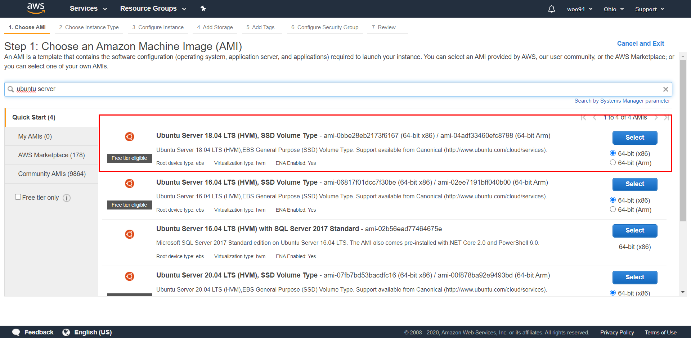
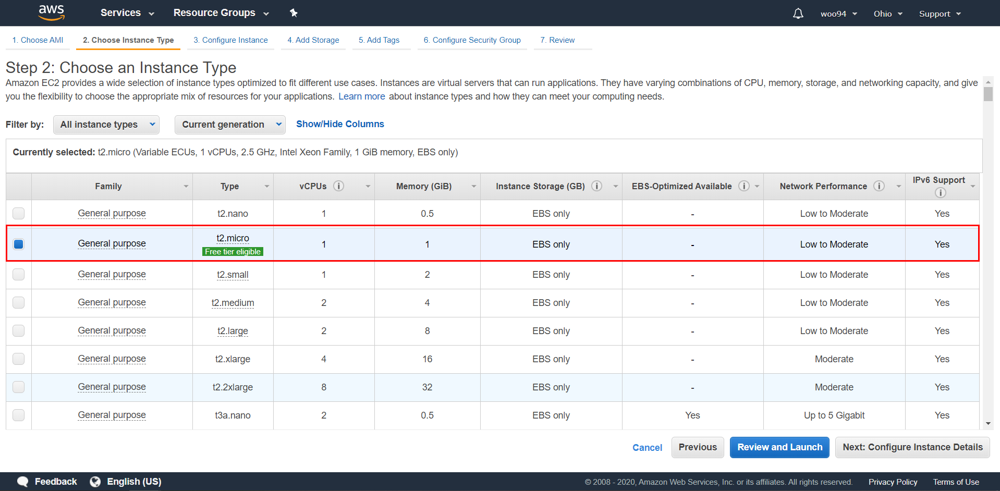
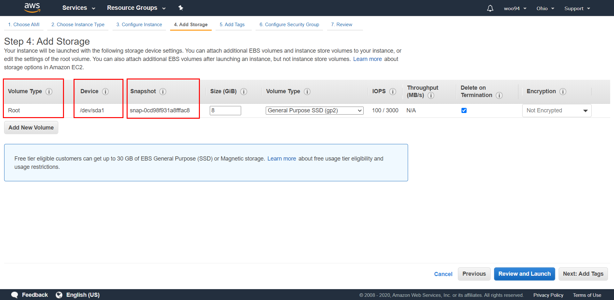
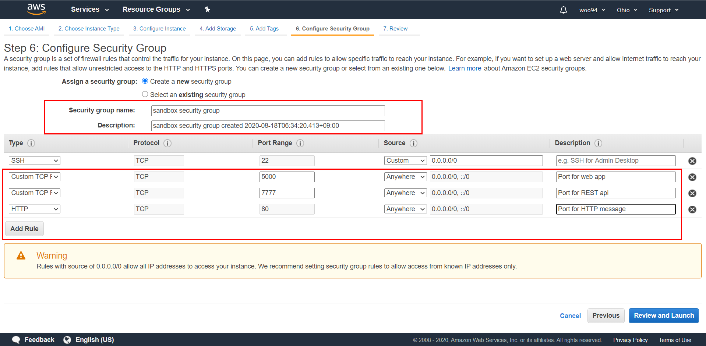

7월쯤에 mongodb를 눈팅하다가 현재 나온 버전이 ubuntu server 18.04 LTS까지 지원해준다고해서 20.04 LTS 버전이 있어도 18.04 버전을 골랐다
 
 

많은 것을 할게 아니라서 free tier에서 추천해주는 인스턴스 타입으로 설정해주었다
 
 

Root volume에 device 이름을 /dev/sda1 로 EC2에서 제공해주는 ubuntu server 18.04 LTS의 EBS 스냅샷을 사용한다.
 
 

인스턴스를 생성해준 뒤에 보안규칙을 생성할 수도 있지만 그냥 여기에서 해주겠다.  
TCP포트 5000번을 웹앱의 포트로, 7777번을 REST api용으로, 그리고 HTTP통신을 위해서 80번 포트를 열어둔다.
 
 

사진찍는걸 깜빡했는데 키파일을 새로 생성해서 폴더에 저장해두었다...
Window 기반 OS에서 putty를 이용하여 접속하려면 .ppk의 확장자로 하지만, 난 ssh 통신을 사용하여 인스턴스에 접속하려하므로 .pem의 키파일을 생성하였다.
