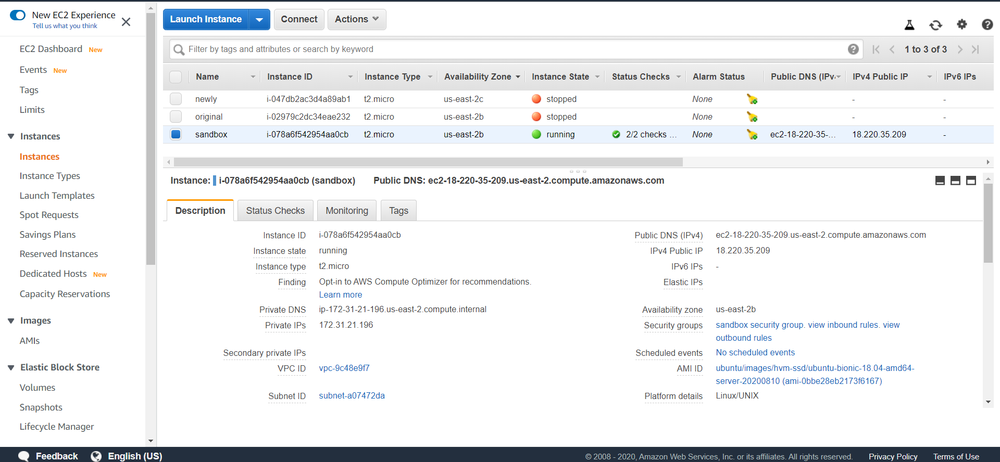

나의 EC2 Dashboard로 가서 방금 생성한 인스턴스의 Public DNS를 복사해준다.  
 
 

매번 저 긴 DNS를 치기도 귀찮고, 외울수도 없어서 따로 command.txt라는 텍스트파일을 만들어서 접속시 필요한 커맨드를 저장해두었다. 접속하고 싶을때는 cat command.txt 라는 명령어를 콘솔에 입력해주어 파일 속 커맨드를 복사 붙여넣기 한다. 현재 내용은 sandbox.pem 이라는 identity file(-i)를 가지고 ssh 접속을 하는데, 계정은 ubuntu이며 @ 뒤에 입력된 주소로 접속을 한다는 의미이다.  
Ubuntu 계열의 AMI의 경우 기본 사용자 이름이 ubuntu라고 한다.
 
 

키파일로 처음 접속시에 항상 물어본다. yes를 입력해주어 나의 키파일을 인스턴스에 등록시켜준다.  
 
 

접속된 화면이다.
