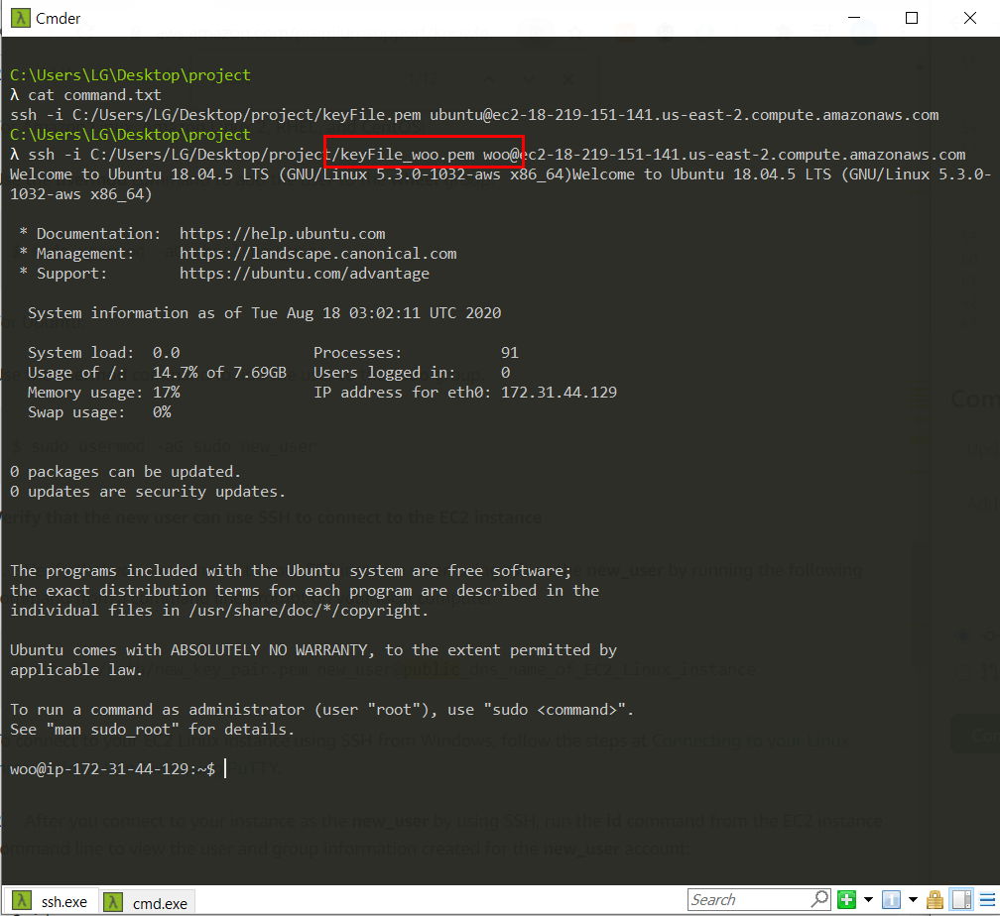

Ubuntu 계열의 리눅스의 경우, 기본 계정과 root 계정이 존재한다.  
root 계정은 administrator 로써 모든 권한을 가지고 있다. root가 아닌 계정이 root에 준하는 권한을 사용하기 위해서는 sudo라는 command를 입력해주어야 된다.  
기본으로 제공해주는 ubuntu에 root 권한을 주기보다는 새로운 계정을 만들어서 root권한을 부여하는 식의 플로우가 건전하다.  

새로 만드는 계정은 다음과 같은 조건을 만족해야한다.
1. root 권한을 가진다.
2. ssh을 이용해 해당 계정으로 바로 접속이 가능하다.
3. 2번 단계 수행시 비밀번호를 요구하지 않는다.
(3번 조건의 경우 Filezilla를 이용하기 위한 조건이다)  

### 계정생성 이전에 키파일을 가지고 어떻게 서버 인스턴스에 접속이 가능한지 알아보자.

하나의 키는 private key, public key의 2가지 형태로 존재한다. Private key의 경우 인스턴스에 접속하려는 사용자의 pc에 .pem 파일로 저장되어있다. Public key는 EC2 콘솔의 키페어로, 그리고 서버 인스턴스 내부에 저장되어있다. 접속시에 사용자가 제시한 계정과 private key가 인스턴스 내부의 public key(계정에 해당하는)와 일치하는지 확인한다.
   

### Public key가 어디에 존재하는지 알아보자.
1.ubuntu 계정의 경우, /home/ubuntu/.ssh/authorized_keys 에 존재한다.  
해당 파일을 열어보니 rsa 형식의 키가 있고, public key의 내용과 한칸을 띄고 키파일의 이름이 적혀있다(도중에 sandbox->keyFile로 키파일 이름을 변경하였다).
 

  

2.root 계정의 경우, /root/.ssh/authorized_keys 에 존재한다.  
ubuntu 계정과 같은 형식의 내용의 파일이고 놀랍게도 키파일 이름이 ubuntu 계정과 일치했다. 하지만 root로 로그인하지 말아달라고 하니  않기로 하겠다.

  

새로 만든 계정 또한 기존 혹은 새로운 키파일의 public key 내용이 해당 계정(/home/[user_name])의 .ssh/authorized_keys 파일에 존재하면 되겠다.

### 우선 'woo' 라는 새로운 계정을 만들어서 root 권한을 부여해주자.

 
adduser 커맨드를 사용하고 --disabled-password option을 추가해주어서 해당 계정으로 접속 시 비밀번호를 요구하지 않게한다. 
  

 
sudo su - woo 커맨드를 사용하여 해당 계정으로 사용자 전환을 한다. '-'는 해당 사용자의 권한으로 security context를 전환하겠다는 뜻이다.
  

 
woo 계정의 home directory(/home/woo) 에 .ssh 디렉토리가 존재하는지 본다. 존재하지 않는다. 'mkdir .ssh' 커맨드로 디렉토리를 생성해주고 'chmod 700 .ssh' 로 디렉토리의 permission을 변경해준다.
  

 
'touch .ssh/authorized_keys' 커맨드로 파일을 생성해주고 'chmod 600 .ssh/authorized_keys' 커맨드로 permission을 변경해준다. 
  

### 이제 EC2 dashboard에 가서 키 페어를 생성하고, private key를 받아오자.

 
다음과 같이 keyFile_woo.pem 파일을 받는다. 현재 받은 파일은 private key이고, 이에 대한 public key를 가져와야 된다. 'ssh-keygen -y -f /path_to_key_pair/my-key-pair.pem' 커맨드를 사용해서 퍼블릭 키를 반환해보자.
  

 
이제 이 내용을 서버 인스턴스의 /home/woo/.ssh/authorized_keys 에 넣는다.
  

 
한칸 띄어쓰고 keyFile_woo 를 적는 것으로 끝낸다.
  

 
해당 키 페어의 지문을 확인한다. 로컬 pc에 있는 private key가 EC2 dashboard에 존재하는 public key와 일치하는지 확인한다. 'openssl pkcs8 -in path_to_private_key -inform PEM -outform DER -topk8 -nocrypt | openssl sha1 -c' 커맨드를 이용한다.
  

 
'sudo usermod -aG sudo woo' 커맨드를 사용하여 woo 계정에 root 권한을 부여해준다(sudo 그룹에 woo 계정을 추가하는 커맨드이다). 이때, woo 계정은 아직 root권한이 없으므로 sudo 커맨드를 사용하지 못한다. root 혹은 ubuntu 계정으로 exit한 뒤 커맨드를 실행한다. 
woo 계정이 sudo 그룹에 제대로 되었는지 /etc/group 에 들어가서 확인해본다.
  

 
이제 새로운 키파일을 가지고 인스턴스에 접속해본다.
