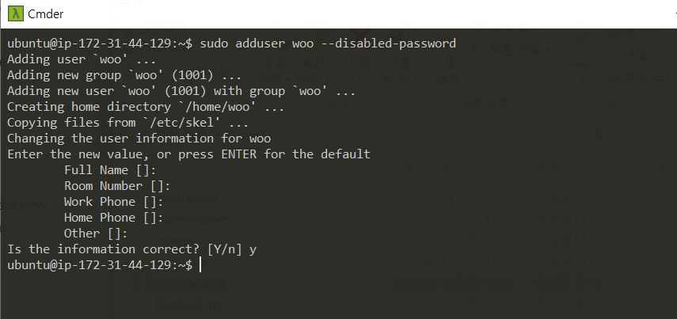
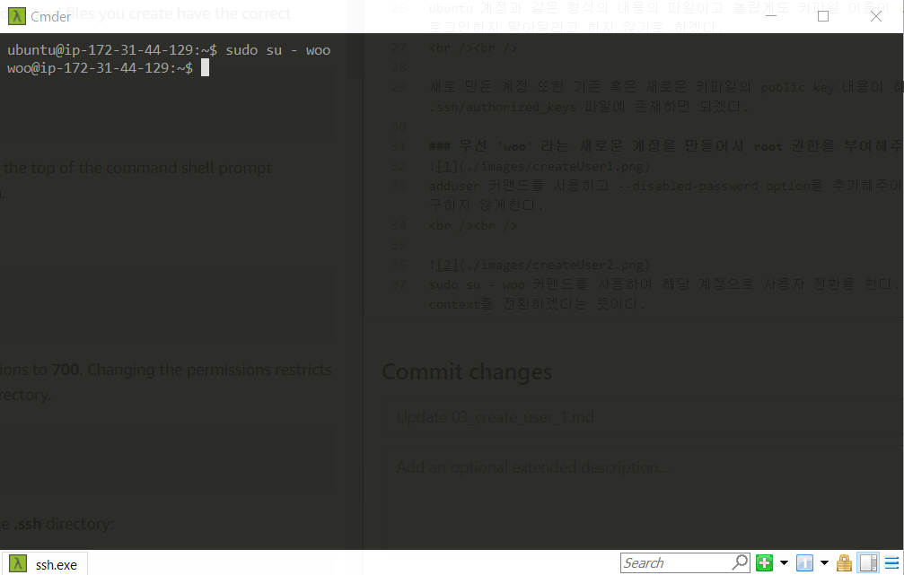
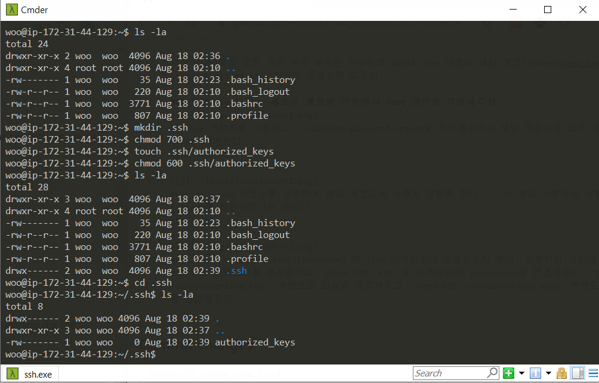
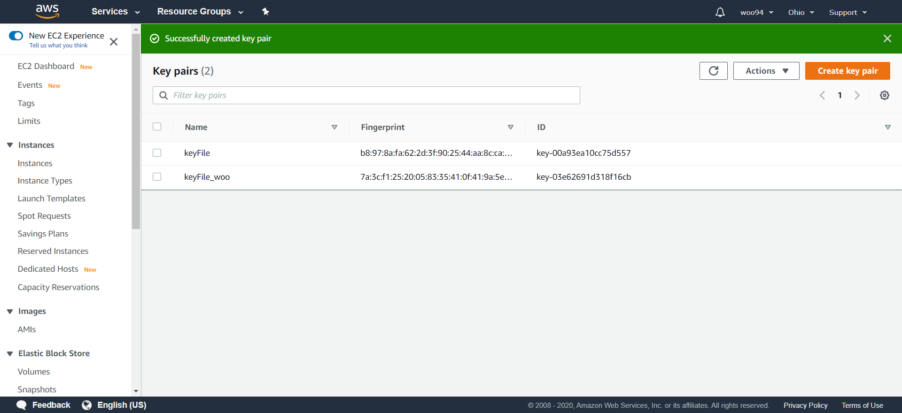
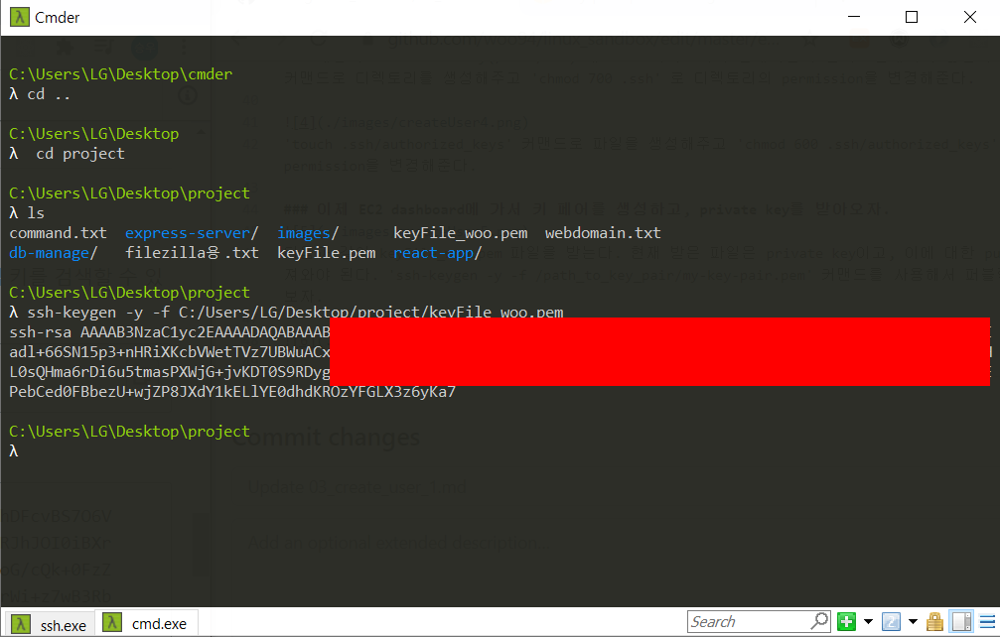

Ubuntu 계열의 리눅스의 경우, 기본 계정과 root 계정이 존재한다.  
Root 계졍은 administrator 로써 모든 권한을 가지고 있다. Root가 아닌 계정이 root에 준하는 권한을 사용하기 위해서는 sudo라는 command를 입력해주어야 된다.  
기본으로 제공해주는 ubuntu에 root 권한을 주기보다는 새로운 계정을 만들어서 root권한을 부여하는 식의 플로우가 건전하다.  

sudo su 커맨드로 일단 ubuntu에서 root 계정으로 사용자를 전환해준다. su [user_name]은 user_name에 적힌 사용자의 계정으로 사용자를 전환하겠다는 커맨드인데 [user_name]이 생략될 시에는 root로 전환하라는 의미이다.  

권한을 받을 계정을 만들어준다(woo).
 
 

해당 계정으로 ssh 접속은 불가능하다. 가지고 있는 키파일은 ubuntu 계정으로만 접속이 가능하기 때문이다.
이 문제를 해결해야 된다. Ubuntu server의 경우, GUI를 없애고 커널에 집중된 이미지파일이다. 때문에 코드를 작성할때 매우 불편하다. 에디터의 장점을 살리기도 힘들고,
웬만하면 안에서는 코드를 작성하지 않으려한다. 원래 remote-ssh를 이용하여 코드를 작성하려고 하였으나, 동기화 과정에서 서버가 2번이나 뻑이나서 이 방법은 사용하지 않기로 했다.
내 로컬 pc에서 코드를 작성한 뒤 filezilla에서 sftp 프로토콜을 사용하여 파일을 전송하려고 한다. 현재 서버 인스턴스에 접속할 수 있는 유일한 방법은 인스턴스 생성시 받은 키파일이 유일한데, 
해당 키파일을 사용하면 ubuntu 계정으로 로그인이 된다. 파일 쓰기에는 root 권한이 필요한데, ubuntu는 root 권한이 없으므로, 해당 키파일로 서버와의 연결을 성공해도 결국 파일 전송에 실패하게 된다.
즉, 위에서 만든 woo 계정에 root 권한을 부여해준 뒤, 새로운 키파일을 생성해 서버의 woo 계정으로 바로 접속이 가능하면 모든 문제가 해결되는 것이다.
 
 

키파일에서 ubuntu 계정으로 접속을 가능하게 하는 authorized_keys 파일을 살펴보자.
 
 

다음과 같이 구성되어 있다. root의 경우에도 authorized_keys 파일이 있을까.
 
 

존재한다. 열어보자

 
 

존재하고, 인스턴스 생성시 만든 키파일(sandbox.pem)으로도 접속이 가능하다고 한다. 새로운 정보를 얻었다. 처음 키파일로 ubuntu와 root계정에 둘다 들어갈 수 있다. 하지만 여기로 접속은 하지 말아
달라고 하니 하지 말도록 하자. 우리에겐 어차피 root 권한을 부여받은 woo 계정이 있다.

