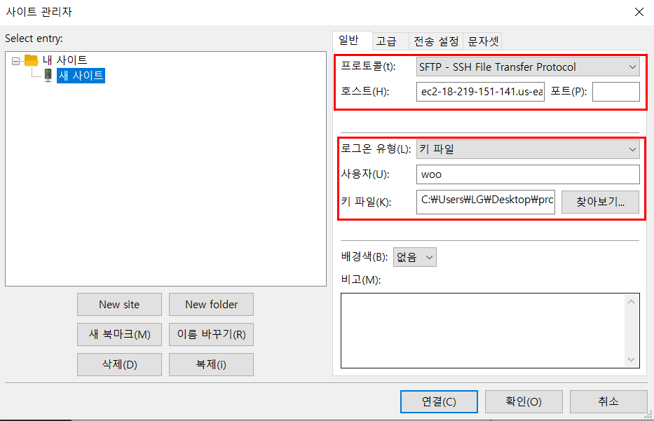
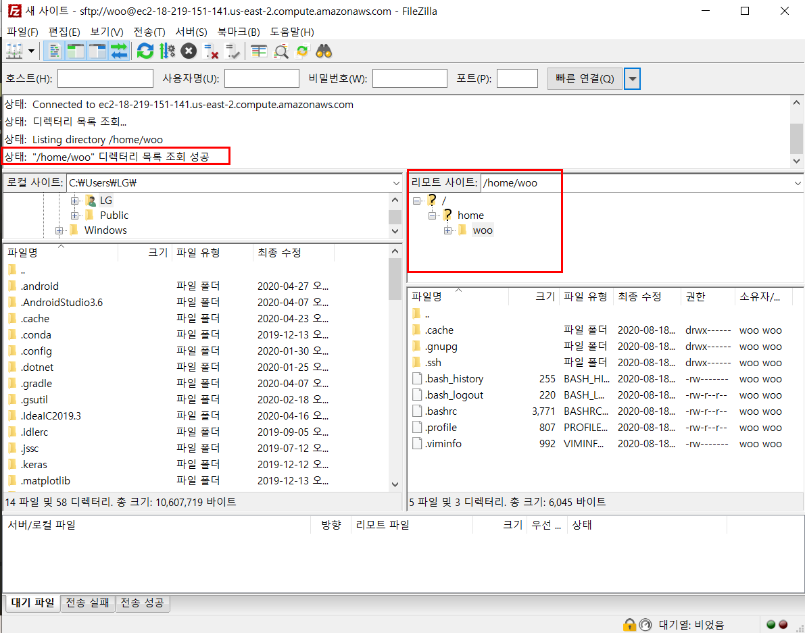
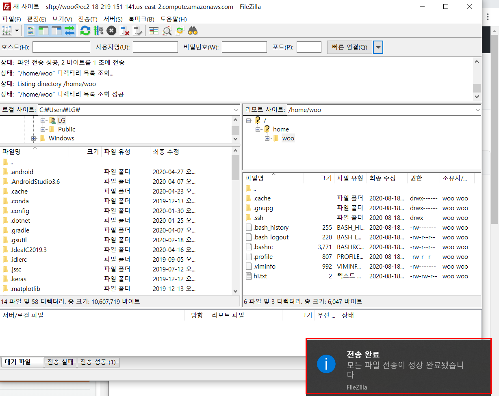
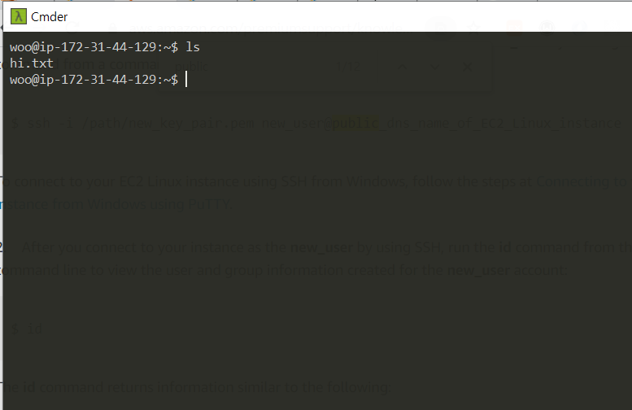

Filezilla client를 설치한 후 파일->사이트 관리자에 들어가서 위와같이 설정해준다. 

연결이 잘 되는지 확인해준다.

/home/woo 디렉토리 아래에 hi.txt라는 간단한 텍스트 파일을 전송해보자. 제대로 전송 되었으니 서버에서 해당 파일을 확인해보겠다

다음과 같이 확인이 잘 된다. 생각해보면 딱히 woo 계정에 root 권한을 줄 필요가 없었던 것 같다. 사용자의 경우 자신의 디렉토리에 쓰기 권한이 있으니 말이다... 그래도 되니깐 넘어가야지
