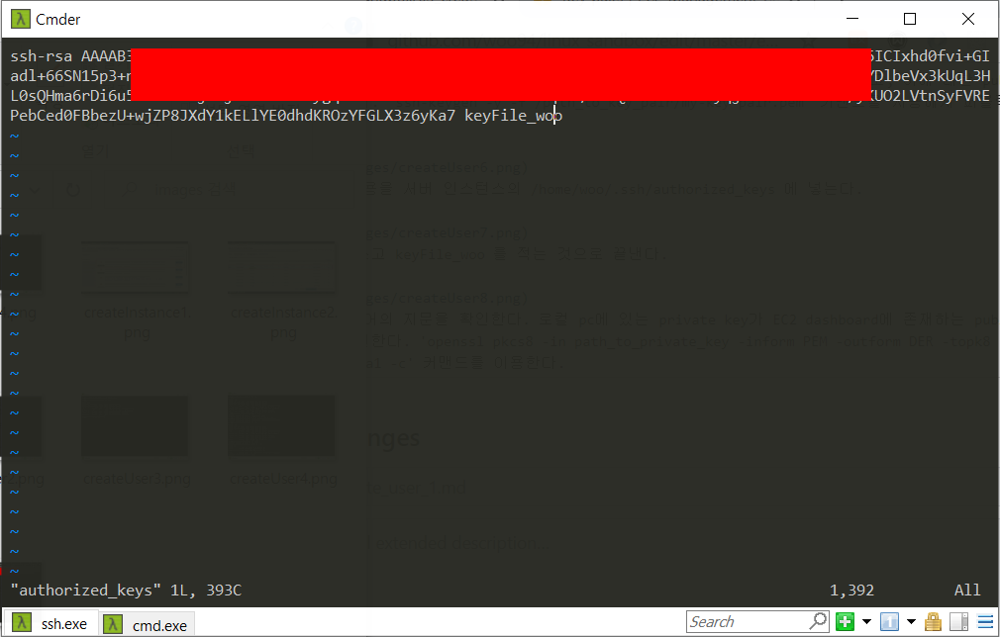

새로만든 woo 계정에는 .ssh 폴더와 그 하위에 authorized_keys 파일이 없다. 그전에 우선 woo 계정에 root 권한을 주도록 하자.
Root 권한은 /etc/sudoers 파일을 수정해줌으로써 부여받을 수 있다.
 
 

/etc/sudoers 파일에 가서 해당 줄을 추가해준다. Readonly file이라고 경고문을 띄워주지만 :wq!를 통해 overwrite해준다(vi editor사용).
 
 

/etc/passwd 파일에 가서 uid와 gid를 모두 0으로 바꾸어준다(Superuser의 경우 uid와 gid는 0이 되어야한다).
 
 

마지막으로 /etc/group 파일에서 root 그룹에 woo 계정을 포함시켜준다.
 
 

reboot를 누르고 키파일로 다시 ubuntu 계정으로 접속한다. 접속한 ubuntu 계정에서 woo 계정으로 사용자 전환을 하였을때 생기는 변화를 본다. root의 권한을 얻게 되었다.
