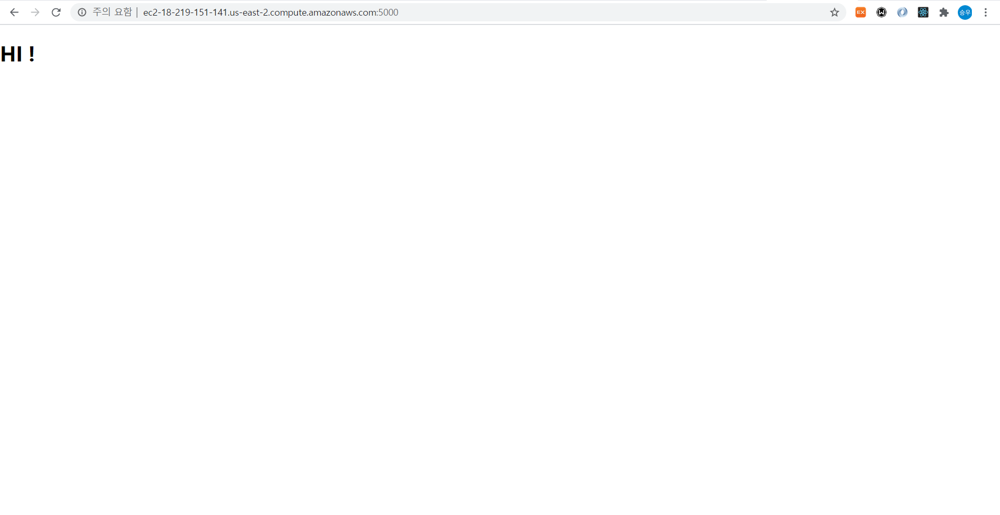

pm2는 Node.js의 프로세스 관리자이다. 총 2개의 nodejs 서비스(web app과 REST API)를 서버에서 운영할 예정인데 이를 모두 백그라운드로 돌려야한다. 
아니면 해당 서비스를 돌리면서 다른작업을 하기 힘들기 때문이다. 바로 전 글에서 mongodb를 백그라운드로 돌릴때 처럼 service 나 systemctl 이용해서 프로세스를 관리하는것은 정말 어렵다. 
pm2에서 해준다는데 그냥 해주는거 받자.  

Node.js는 single thread이다. 즉, 인스턴스의 cpu가 4개, 8개여도 그 중 하나밖에 못쓴다. 타 언어와 비교시에 비동기코드의 관리가 편하지만 그만큼 능률이 좋은 편은 아니라는 말이다. 이를 가능하게 하는 것이 pm2의 cluster mode이다. 같은 작업을 여러개의 cpu에서 처리할수 있게해준다. 이미 Node.js 기본 모듈에 cluster가 포함되어있고 그것의 wrapper class로 pm2의 cluster mode가 지원된다.  

이전에 세팅한 react의 기본앱을 cluster mode로 설정해보겠다.
```
pm2 ecosystem // 이 커맨드를 입력하면 현재 디렉토리에 ecosystem.config.js 파일이 생성된다.
```

파일을 원격으로 배포할일이 없으니 deploy쪽을 모두 지워주고.. apps를 설정해준다
```
module.exports = {
  apps: [{
  name: 'react-app',
  // 1. serve 파일 및 포트 설정
  script: 'serve -s build -l 5000'
  
  // 2. pm2 cluster 설정
  exec_mode: 'cluster',
  instances: 4,
  
  // 3. watch 설정
  watch: true,
  ignore_watch: ['src', 'README.md', 'node_modules', 'public']
  
  // 4. process 재시작 관련 설정
  wait_ready: true,
  listen_timeout: 5000,
  kill_timeout: 4000
  }]
}
```

### 1. serve 파일 및 포트 설정
Node.js 환경에서 static folder를 serve 하는 가벼운 모듈이다. -s 옵션으로 모든 not-found request를 rewrite해준다. -l 5000 을 통해 localhost:5000에 endpoint를 설정해준다.

### 2. pm2 cluster 설정
EC2 dashboard로 가서 내 인스턴스의 vCPU를 보았다. Free tier이다보니 단 한개였다;; 그래도 서비스가 단 한개의 프로세스에 의해서 제공되는것은 에러가 일어날시에 유연한 대처가 어렵다보니 4개로 해주겠다. 1개의 프로세스가 잘못되면 잘못된 프로세스를 종료하고 새로 갈아끼워주면서 기존의 프로세스가 대신 일을 수행해준다. cluster mode로 인해서, 하나의 포트에 4개의 process를 걸어두고 사용할 수 있다.

### 3. watch 설정
파일의 변경을 감지하고, 변경이 감지되면 stop & restart해주는 옵션이다. 이 옵션이 없으면 파일이 바뀔때마다 'pm2 reload [process_name]' 혹은 'pm2 stop [process_name] 이후 pm2 restart [process_name]'의 커맨드로 눌러줘야된다. 이때, ignore_watch: ["file name"]을 설정해주어서 불필요한 watch를 없앤다. 현재 프로세스는 build 디렉토리 안에 있는 정적 파일 만을 serve하는 프로세스 이므로 나머지 파일들을 이 안에 적어준다('src', 'node_modules'...).

### 4.process 재시작 관련 설정
pm2는 process manager로써 프로세스와 신호를 주고받아 이를 처리한다. pm2 -> 각 프로세스로 보내는 신호, 각 프로세스 -> pm2로 보내는 두가지 신호가 있다. pm2가 각 프로세스로 보내는 신호에는 SIGINT(프로세스 종료요청)와 SIGKILL(프로세스 강제종료 및 삭제)이 있고, 각 프로세스에서 pm2로 보내는 신호는 ready(프로세스의 초기화가 끝나 시작해도 됨을 알림)가 있다.  
- 'wait_ready: true' 의 경우 프로세스에서 pm2로 보내는 ready 신호를 사용할 것인지를 설정해준다
- 'listen_timeout': ready 신호가 오지 않으면 강제로 reload 시키는 시간을 설정한다.
- 'kill_timeout': pm2는 프로세스 종료를 원할시 해당 프로세스로 SIGINT를 보내고, kill_timeout의 시간이 지난 뒤에 SIGKILL을 보내 프로세스를 종료시킨다. 이 시간을 4초로 설정하겠다.

### 시작하기
```
pm2 start ecosystem.config.js
```
위 커맨드를 입력하면 된다.

### ! Error발생
cluster mode에서 error가 발생한다. Debug결과 Using 2 paralleism이라면서 안된다. 이전 서버에서 fork 모드만 사용해서 이왕 새로하는거 cluster mode를 사용하고 싶었는데... CPU가 하나라서 안되나보다. 주석 2번 아래 코드를 전부 지워줘야겠다.

### watch & restart 확인하기
```
//react-app/src/App.js의 내용을 다음과 같이 변경해준다

import React from 'react';
import logo from './logo.svg';
import './App.css';

function App() {
  return (
   <h1> HI ! </h1>
  );
}

export default App;
```

아래 명령어로 바뀐 웹앱을 빌드해준다. 이 명령어로 build 폴더의 내부 내용이 바뀐다. 이론상은 build 폴더의 내용이 바뀌니 pm2는 이를 감지해서 프로세스를 reload 해야된다.
```
npm run build
```

<br><br>
watch와 restart가 제대로 되는 것을 확인하였다.


정적인 react build file 같은 경우는 사실 단 한번 web app을 다운로드 받으면 되는 일이기 때문에 프로세스 종료와 재시작같을때 신호를 주고 받는것이 무의미할 수 있다. Express server에서 pm2와 signal을 주고받는 flow를 다음글에서 설명하겠다.


