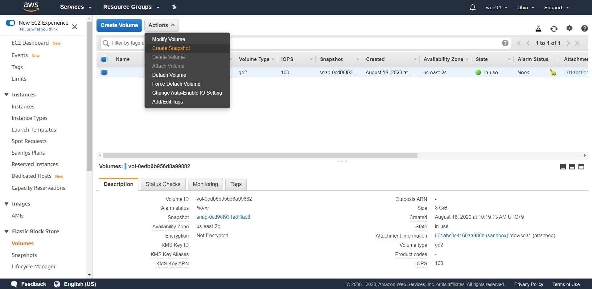

여기까지 한 기본적인 세팅을 스냅샷을 찍어서 복원점으로 만들려고 한다. 나중에 또 서버가 죽으면 ubuntu server를 다시 AMI로 설정하고,
volume을 현재 스냅샷으로 하면 된다. 절차는 어렵지 않다.

  
위와 같이 대시보드에서 EBS -> Volumes 태그로 가서 Actions-> Create Snapshot을 눌러주면 된다.

  
제대로 저장이 되었나 확인하는 사진이다.
